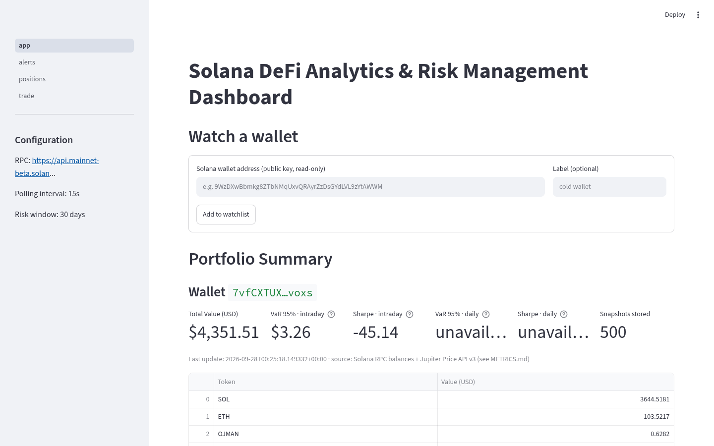
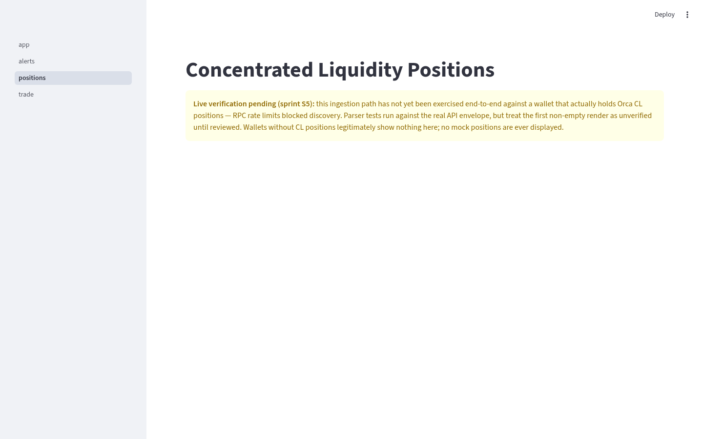
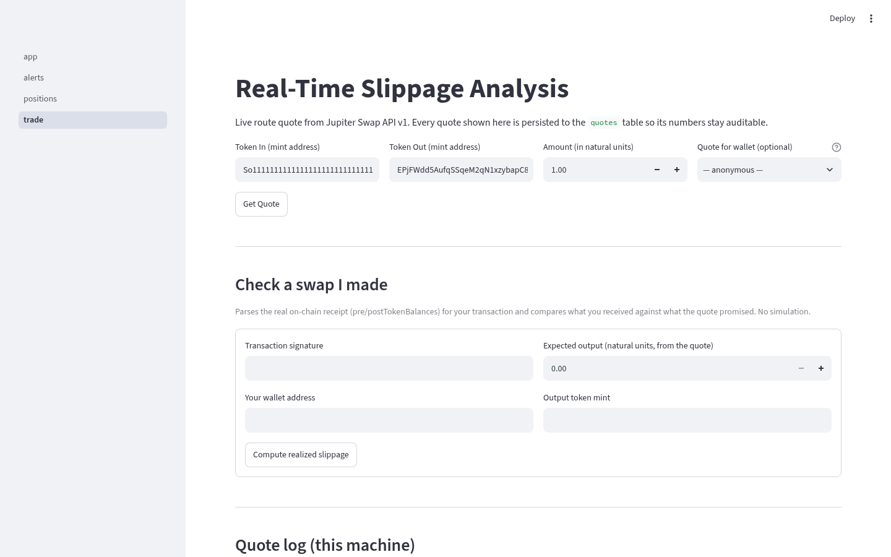
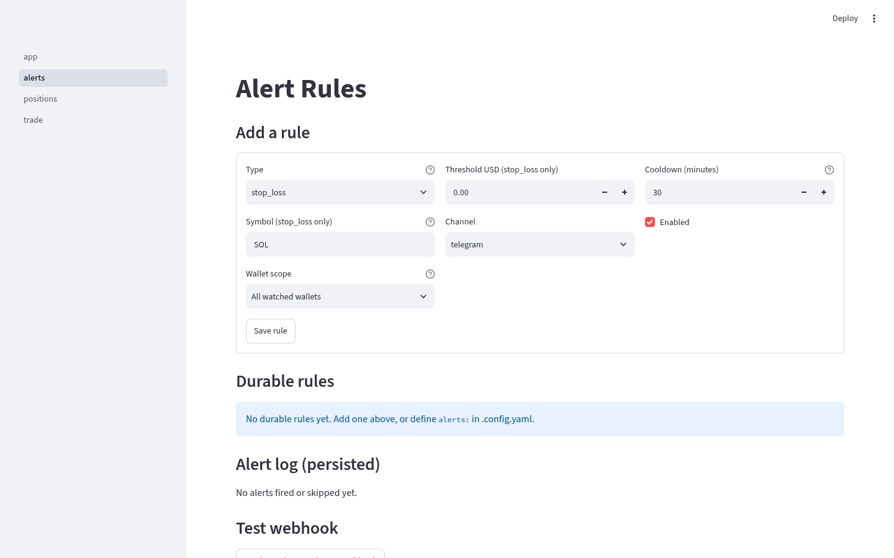

# Solana DeFi Dashboard


**Live website:** https://solana-defi-dashboard-ashen.vercel.app

An independent, read-only analytics and risk-monitoring tool for Solana DeFi.
It polls your wallets against public infrastructure (Solana RPC, Jupiter, Orca),
persists everything to a local SQLite database, and renders an honest portfolio,
concentrated-liquidity, and slippage picture — with alerts to Telegram/Discord.

**The core rule: unavailable beats fabricated.** Every displayed number is
traceable to a documented source in [`METRICS.md`](METRICS.md); anything that
cannot be fetched is rendered as "unavailable" with a reason. There are no
mock quotes, no seeded metrics, and no signing, sending, or custody of any kind.

## Features

- **Live swap analysis** — Jupiter Swap API v1 quotes: expected price, price
  impact, slippage, and per-AMM route breakdown. Every quote shown is persisted
  for audit.
- **Realized slippage from receipts** — parse any of your transactions'
  on-chain `pre/postTokenBalances` and compare what you received against what
  the quote promised.
- **Full-portfolio balances** — one program-scoped RPC scan per token program
  returns *every* SPL mint a wallet holds (Token + Token-2022), priced via
  Jupiter Price v3, named via Metaplex metadata (no allowlists).
- **Orca concentrated-liquidity monitoring** — positions ingested from the
  Orca v2 API with the pool's live tick deciding in/out-of-range; 7-day tick
  and fee history with charts.
- **Risk metrics with honest horizons** — intraday and daily VaR/Sharpe
  computed only from stored real history; "unavailable (n samples)" until
  thresholds are met.
- **Durable alert rules** — stop-loss on live prices, out-of-range on real
  positions, per-rule cooldowns, wallet scoping, and a persisted delivery log
  (`delivered=1` only after a webhook 2xx).
- **Read-only by design** — no private keys, no transaction building, no
  execution. Fee harvesting and simulation raise explicit errors.

## Architecture

```
Solana RPC · Jupiter (swap v1 / price v3) · Metaplex PDAs · Orca v2 API
        │
        ▼
 daemon tick ──► SQLite (.data/dashboard.db) ◄── Streamlit dashboard
        │            snapshots · balances · positions(history)
        ▼            alert_rules · alerts_log · quotes · token_meta
 alert engine ──► Telegram / Discord webhooks
```

The daemon writes, the dashboard reads, and the SQLite file is the only
cross-process state. Python 3.12, `asyncio`/`aiohttp` with real retry/backoff,
WAL-mode SQLite. ~2,600 LOC, 114 tests, deterministic CI (live network tests
run as a separate informational step).

## Screenshots

| Portfolio | Positions |
|---|---|
|  |  |
| **Trade** | **Alerts** |
|  |  |

## Installation

```bash
git clone https://github.com/blalou80/solana-defi-dashboard.git
cd solana-defi-dashboard
python -m venv .venv && source .venv/bin/activate
pip install -r requirements.lock.txt && pip install -e .
cp .config.yaml.example .config.yaml   # set rpc_endpoint
cp .env.example .env                   # optional: webhook URLs
```

A keyed RPC endpoint (e.g. free Helius tier) is strongly recommended for
continuous polling; the public mainnet endpoint rate-limits.

## Quick start

```bash
defi-up        # daemon + dashboard together (Ctrl-C stops both)
open http://localhost:8501
# add a wallet address in the browser form — polled on the next tick
```

Individual commands: `defi-daemon`, `defi-quote quote <mintIn> <mintOut> <amount>`,
`streamlit run src/dashboard/app.py`, `python -m pytest tests -q`.

Deployment recipes for systemd and docker-compose live in [`deploy/`](deploy)
(SQLite needs a disk — not serverless). The dashboard binds to localhost by
default; put a reverse proxy with auth in front before any public exposure.

## Current status

A solid **single-user local tool**, not a hosted product. Working and
browser-verified: balances, prices, token registry, quotes, quote log,
realized-slippage parsing, alert rules with cooldowns, the dashboard itself.
Honest open items: Orca position ingestion is tested against the real API
envelope but has not yet rendered a wallet that actually holds a position (the
UI says so explicitly); alert delivery is verified against a local webhook
sink, not yet a live bot; there is no multi-user auth or hosting layer.
Releases: [GitHub Releases](https://github.com/blalou80/solana-defi-dashboard/releases) ·
history: [`CHANGELOG.md`](CHANGELOG.md).

## Roadmap (near-term)

1. Live verification pass: first real position-holding wallet + first real
   Telegram delivery.
2. Keyed-RPC configuration path and polling backpressure.
3. Position/quote export (CSV) and richer history views.
4. Hosted single-tenant beta (auth + per-user watchlists).

## Contributing

Issues and PRs are welcome — see [`CONTRIBUTING.md`](CONTRIBUTING.md).
Ground rules: read-only product (nothing signs or sends), no fabricated data
in any code path or UI state, every displayed metric documented in
`METRICS.md`, tests required for new modules (`ruff check src tests` and
`pytest -m "not live"` must pass).

## License

MIT — see [LICENSE](LICENSE).

*Independent project. Not affiliated with the Solana Foundation. Nothing here
is financial advice.*
