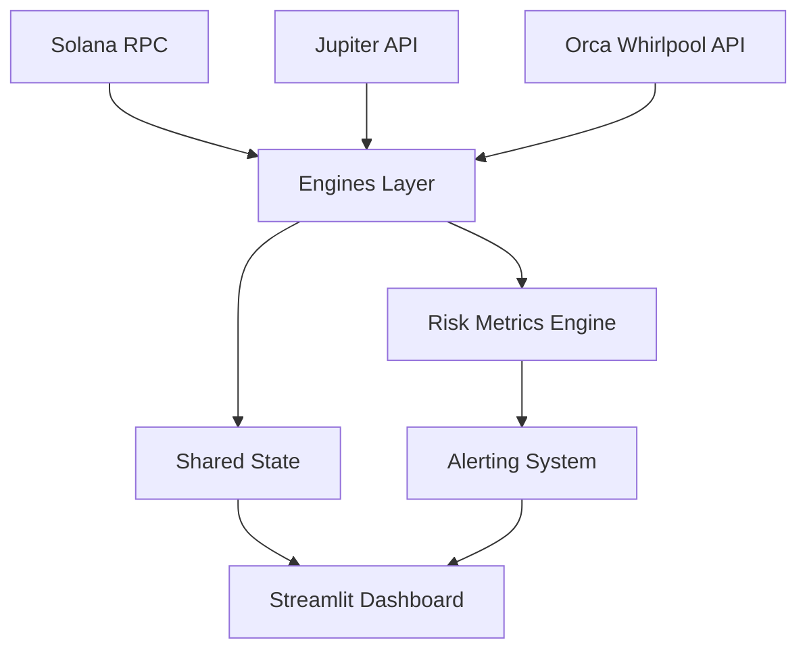

# Solana DeFi Analytics & Risk Management Dashboard

[](https://www.python.org/downloads/)
[](https://opensource.org/licenses/MIT)
[](https://streamlit.io/)

A Python toolkit for DeFi analytics and risk management on Solana. As of 2026-09-27 (Phases 0–4 complete): real Jupiter Swap API v1 quotes, real RPC wallet balances and Orca Whirlpool positions (live pool ticks) persisted to SQLite, history-driven VaR/Sharpe that show "unavailable" until enough real samples exist, on-chain receipt parsing for realized slippage, and Telegram/Discord alerts that fire on live prices with per-target cooldowns. Fee harvesting, transaction building/simulation and trade execution remain **not implemented** — those functions raise explicit errors instead of returning mock data. `METRICS.md` is the ground-truth table for every displayed value.

## ✨ Features

- **Real-Time Slippage Engine**: Fetch live quotes from Jupiter Aggregator (Swap API v1), compute expected price, price impact, and slippage from real route plans.
- **Concentrated Liquidity Monitor**: Orca Whirlpool positions are ingested every daemon tick via the live Orca v2 API, with the pool's real `tickCurrentIndex` deciding in/out-of-range. **Status: awaiting live verification** — the path is tested against the real API envelope but has not yet rendered a wallet that holds actual positions (sprint S5); the dashboard shows an explicit pending banner until it does. IL, net-yield and range math are implemented and tested. Raydium CLMM ingestion is not connected (no mock fallback).
- **Risk Dashboard**: Interactive UI showing portfolio value, token exposure, VaR, Sharpe ratio, and automated alerts via Telegram/Discord. VaR/Sharpe require ≥20/≥5 stored snapshots and display "unavailable" until real history exists.
- **SQLite Shared State**: The daemon writes snapshots to `.data/dashboard.db`; the dashboard reads them — one persisted source of truth across processes.
- **Async-First Architecture**: Built with `asyncio` and `aiohttp` with working async retry/backoff on all network calls.
- **Modular & Extensible**: Clean separation of concerns with well-defined interfaces between data engines, risk calculations, and presentation layer.

## 📊 DeFi Calculation Capabilities

### Impermanent Loss (IL)
```python
def compute_impermanent_loss(price_current: float, price_entry: float) -> float:
    """Compute impermanent loss percentage."""
    if price_entry == 0:
        return 0.0
    ratio = price_current / price_entry
    il = 2 * math.sqrt(ratio) / (1 + ratio) - 1
    return abs(il) * 100  # as percentage
```

### Slippage Analysis
- Fetches route data from Jupiter Swap API v1 (`lite-api.jup.ag/swap/v1`)
- Computes price impact percentage and slippage basis points
- Compares multiple routes for optimal execution
- Tracks realized slippage from on-chain transaction receipts

### Yield Calculations
```python
def compute_net_yield(fees_earned: float, impermanent_loss: float, liquidity: float, time_days: float = 30) -> float:
    """Compute net yield annualized percentage."""
    if liquidity == 0 or time_days == 0:
        return 0.0
    net = fees_earned - impermanent_loss
    annualized = (net / liquidity) * (365 / time_days) * 100
    return annualized
```

## 🏗️ Architecture



### Layers
1. **Data Ingestion Layer** (`src/engines/`)
   - Jupiter API client for swap quotes and route analysis
   - Solana RPC clients for position and transaction data
   - Protocol-specific parser for Orca Whirlpools (Raydium CLMM was cut at the W5 gate: their v3 API exposes no reachable position-by-owner endpoint — see specs/004 §W5)

2. **Core Logic Layer**
   - `src/engines/liquidity.py`: Position tracking, IL, fee calculations
   - `src/engines/slippage.py`: Route comparison and slippage metrics
   - `src/risk/metrics.py`: Portfolio risk (VaR, Sharpe, diversification)
   - `src/risk/alerts.py`: Notification dispatch (Telegram, Discord, email)

3. **State Management** (`src/state.py`)
   - Thread-safe in-memory store for positions, trades, and portfolio state
   - Singleton pattern with update functions from background tasks

4. **Presentation Layer** (`src/dashboard/`)
   - Main Streamlit application (`app.py`)
   - Modular pages for different views (Trades, Positions, Analytics)
   - Real-time charts with Plotly and native Streamlit components

5. **Configuration & Utilities**
   - `src/config.py`: YAML-based configuration with environment overrides
   - `src/utils.py`: Logging configuration, retry decorators, async helpers
   - `src/models.py`: Pydantic data models for type safety and validation

## 📈 Test Coverage

Run tests with:
```bash
pytest tests/ -q        # 83 tests
ruff check src tests    # lint gate (config in pyproject.toml)
```

Suite contents (all passing as of 2026-09-27):
- **Import smoke test** — every module under `src/` must import (43 cases; guards the failure class that once left half the codebase dead)
- **Unit** — IL, slippage metric parsing (real Jupiter v1 fixture), VaR/Sharpe, retry semantics
- **Integration (live network, self-skipping)** — Jupiter quote, Orca pool tick, on-chain receipt fetch
- **Persistence** — SQLite snapshot roundtrip, metrics refusing low history, alert cooldowns
- **End-to-end alerts** — config alert → live price → webhook sink → `delivered=1` → cooldown

The former `tests/integration` / `tests/contract` directories are empty placeholders; the claims about them were removed rather than kept aspirational.

## 🚀 Quickstart

### Prerequisites
- Python 3.12+ (pinned deps require it)
- Solana RPC endpoint (public mainnet works; a keyed Helius/QuickNode endpoint is recommended for continuous polling)
- (Optional) Telegram/Discord webhook URLs for alerts

```bash
git clone https://github.com/blalou80/solana-defi-dashboard.git
cd solana-defi-dashboard
python -m venv .venv && source .venv/bin/activate
pip install -r requirements.lock.txt && pip install -e .

cp .config.yaml.example .config.yaml   # set rpc_endpoint; watch wallets from the UI
cp .env.example .env                   # optional: webhook URLs

defi-up        # daemon + dashboard together, Ctrl-C stops both
```

Individual commands once installed (`pip install -e .`):

| Command | What it does |
|---|---|
| `defi-up` | daemon + Streamlit dashboard in one shot (http://localhost:8501) |
| `defi-daemon` | data collector only: polls watched wallets, persists to `.data/dashboard.db` |
| `defi-quote quote <mintIn> <mintOut> <amount>` | live Jupiter route table (also logged to the `quotes` table) |
| `streamlit run src/dashboard/app.py` | dashboard only (reads whatever the daemon persisted) |
| `python -m pytest tests/ -q` | the full test suite |

### Production notes
SQLite needs a disk — deploy the daemon and dashboard on one host with a
persistent volume. Ready-made recipes in [`deploy/`](deploy/):
`solana-defi-daemon.service` + `solana-defi-dashboard.service` (systemd
pair) or `docker-compose.yml` (shared volume). The dashboard binds to
localhost by default in the systemd unit — put a reverse proxy with auth
in front before any public exposure. Do not deploy on serverless.

## � kml Configuration Files

### `.config.yaml`
```yaml
rpc_endpoint: "https://api.mainnet-beta.solana.com"  # or your Helius/QuickNode endpoint
polling_interval_sec: 15                            # How often to update positions
risk_window_days: 30                                # Lookback period for risk metrics
portfolio_assets:                                   # Tokens to track in portfolio
  - "SOL"
  - "USDC"
  - "RAY"
  - "ORCA"
alert_channels:                                     # Enable/disable alert channels
  telegram: false
  email: false
  discord: false
```

### `.env`
```env
# Telegram Alerts (optional)
TELEGRAM_BOT_TOKEN=your_bot_token_here
TELEGRAM_CHAT_ID=your_chat_id_here

# Discord Alerts (optional)
DISCORD_WEBHOOK_URL=https://discord.com/api/webhooks/...

# Email Alerts (optional - requires SMTP configuration)
SMTP_HOST=smtp.gmail.com
SMTP_PORT=587
SMTP_USER=your_email@gmail.com
SMTP_PASS=your_app_password
ALERT_FROM=your_email@gmail.com
ALERT_TO=recipient@example.com
```

## 🐳 Docker Deployment

A Dockerfile is provided for containerized deployment:

```bash
# Build the image
docker build -t solana-defi-dashboard .

# Run with docker-compose (recommended)
docker-compose up -d

# Or run directly
docker run -p 8501:8501 --name defi-dashboard solana-defi-dashboard
```

See `Dockerfile` and `docker-compose.yml` for details.

## 📚 API Reference

Generated API documentation is available in the `docs/` directory or can be built with:
```bash
pip install -r docs/requirements.txt
mkdocs serve
```

## 🤝 Contributing

Contributions are welcome! Please feel free to submit a Pull Request.

1. Fork the repository
2. Create your feature branch (`git checkout -b feature/amazing-feature`)
3. Commit your changes (`git commit -m 'Add some amazing-feature'`)
4. Push to the branch (`git push origin feature/amazing-feature`)
5. Open a Pull Request

Please make sure to update tests as appropriate and follow the existing code style.

## 📄 License

This project is licensed under the MIT License - see the [LICENSE](LICENSE) file for details.

## 🙏 Acknowledgments

- [Jupiter Aggregator](https://jup.ag/) for their powerful swap API
- [Orca](https://www.orca.so/) for concentrated liquidity position data
- [Streamlit](https://streamlit.io/) for the incredible dashboard framework
- The Solana developer community for excellent documentation and tooling